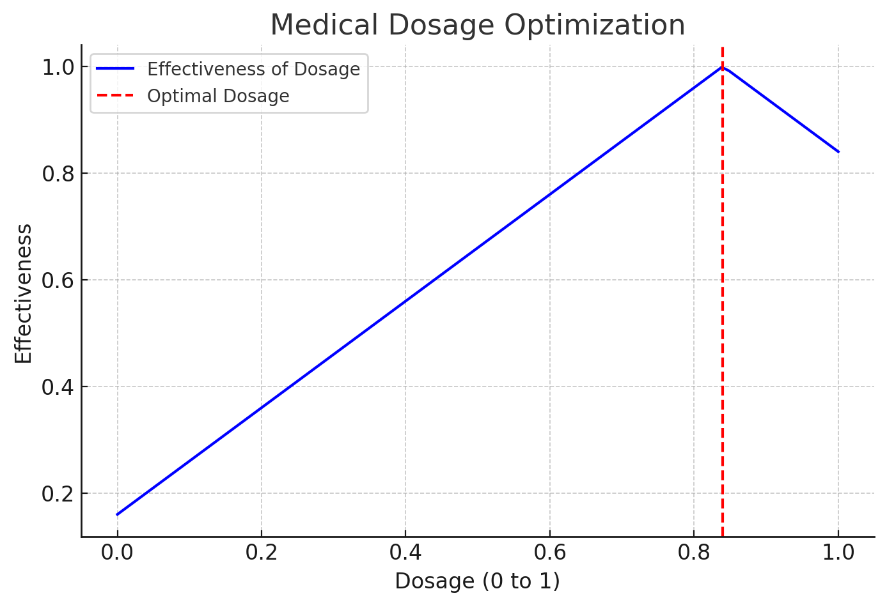

# **Unimodal Function Optimization via Monte Carlo Search**

## **Overview**
This repository contains my implementation of an optimization algorithm for finding the maximum of a unimodal function using constrained evaluations. The problem was structured similarly to a **ternary search**, but with the added challenge of noise in function evaluations, making it a Monte Carlo-style approach.

## Medical Dosage Optimization

This project demonstrates an iterative search algorithm to find the optimal dosage for a patient. The algorithm:
- Samples different dosages.
- Accounts for noise in the data.
- Converges to the best possible dosage over multiple iterations.

### Algorithm Visualization:

## **Problem Statement**
Given a function \( f(x) \) that is unimodal over the range \([0,1]\), the goal is to efficiently determine the value of \( x \) that maximizes \( f(x) \). However, there are constraints:

- The function can only be evaluated **K times per iteration**.
- The total number of iterations allowed is **R**.
- Function evaluations contain **noise**, so multiple evaluations at the same point may return slightly different values.

## **Approach**
The algorithm follows an **adaptive search strategy** with the following key steps:

1. **Initial Sampling**:
   - The search space \([0,1]\) is divided into **K segments**.
   - Function evaluations are gathered at **K evenly spaced points**.

2. **Averaging for Noise Reduction**:
   - Each sampled point is evaluated multiple times.
   - The results are averaged to mitigate noise effects.

3. **Narrowing the Search Space**:
   - After each round, the interval is **refined** by focusing on the region near the best-performing point.
   - The process repeats for **R rounds**, progressively improving precision.

4. **Final Decision**:
   - After all iterations, the best estimated \( x \) is returned as the optimal value.

## **Key Techniques Used**
- **Monte Carlo Sampling**: Handles noisy function evaluations through repeated sampling and averaging.
- **Ternary Search Inspired Interval Reduction**: Reduces the search space efficiently without requiring a perfectly sorted structure.
- **Dynamically Adjusted Sampling Density**: In later rounds, the interval is divided into **smaller segments** for higher precision.

## **Example Output**
Sample logs from function evaluations:

[0.0, 0.25, 0.5, 0.75] [0.16, 0.41, 0.66, 0.91] [0.25, 0.375, 0.5, 0.625] [0.41, 0.535, 0.66, 0.785] ... Final estimated maximum: 0.84

## **Why It Matters**
This type of algorithm has applications in **real-world optimization problems**, such as:
- **Medical Dosage Optimization**: Finding the best dosage for a patient given constraints and variability.
- **Hyperparameter Tuning**: Optimizing parameters in machine learning models with limited evaluations.
- **Sensor Calibration**: Finding the most accurate sensor settings in a noisy environment.

## **Next Steps**
- Improve **sampling density adaptation** to further refine precision.
- Experiment with **weighted averaging** for better noise reduction.
- Compare with **Las Vegas-style deterministic search** approaches.
